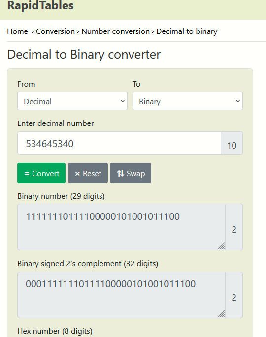
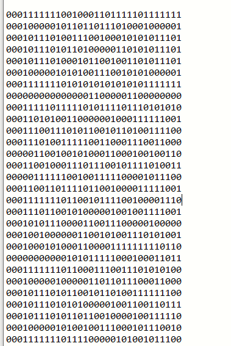
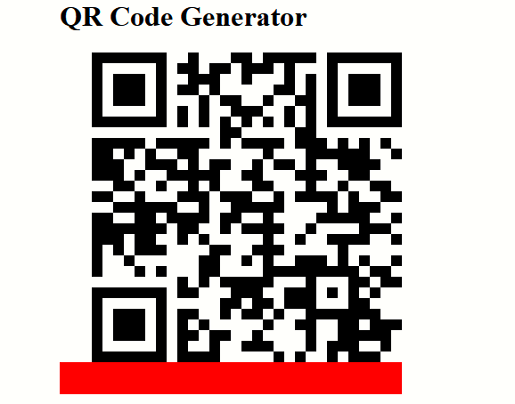

**Challenge:**


We were given a .txt file to work with along with a clue in the challenge description about it being a possible QR code. Opening the file we were able to view the following numbers:


To ensure thats ***ALL*** we were seeing, I ran:

```strings qr_code.txt > strings.txt``` and ```xxd qr_code.txt > hex.txt```

I did this to ensure there wasn't anything hidden in the white space. Nothing out of the ordinary was found so I started to investigate the clue, this being a possible QR Code. Through my research I found that QR Codes are actually binary, with black pixels representing a 1 and white pixels representing a 0. 

I found a [website](https://www.rapidtables.com/convert/number/decimal-to-binary.html) to convert numbers into binary and [another](https://bahamas10.github.io/binary-to-qrcode/) to convert binary into a QR Code.

 

Initially I just took the binary it gave me however, after inputting into the generator it didnt create the code correctly. I thought that it might have to do with the length of the binary as I noticed that all leading zero were omitted. 

I re-did it but this time using the 2's complement. Doing this would ensure that I would get 32 bits of binary for every decimal number inputted this my final output:



I ran binary through the generator to get this QR Code:



Scanning this with a QR reader will get you the flag.

FLAG: csawctf{1_d1dnt_kn0w_th1s_w0uld_w0rk}

