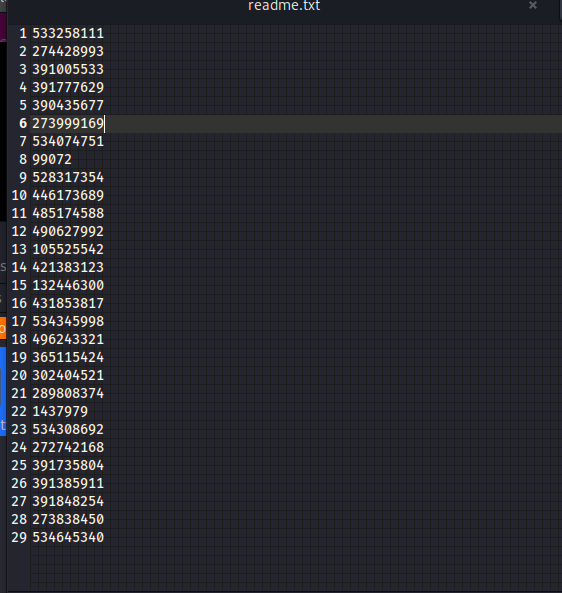

**Challenge:**


We were given a .txt file to work with along with a clue in the challenge description about it being a possible QR code. Opening the file we were able to view the following numbers:



To ensure thats ***ALL*** we were seeing, I ran:

```strings qr_code.txt > strings.txt``` and ```xxd qr_code.txt > hex.txt```

I did this to ensure there wasn't anything hidden in the white space. Nothing out of the ordinary was found so I started to investigate the clue, this being a possible QR Code. Through my research I found that QR Codes are actually binary, with black pixels representing a 1 and white pixels representing a 0. 

From there I went and found a website to convert numbers into binary, https://www.rapidtables.com/convert/number/decimal-to-binary.html, and another to convert binary into a QR Code, https://bahamas10.github.io/binary-to-qrcode/.

Initially I just took the binary it gave me however, after inputting into the generator it didnt create the code correctly. I thought that it might have to do with the length of the binary as I noticed that all leading zero were omitted. So I went ahead and re-did it but this time using the 2's complement. Doing this would ensure that I would get 32 bits of binary for every number inputted.

 
